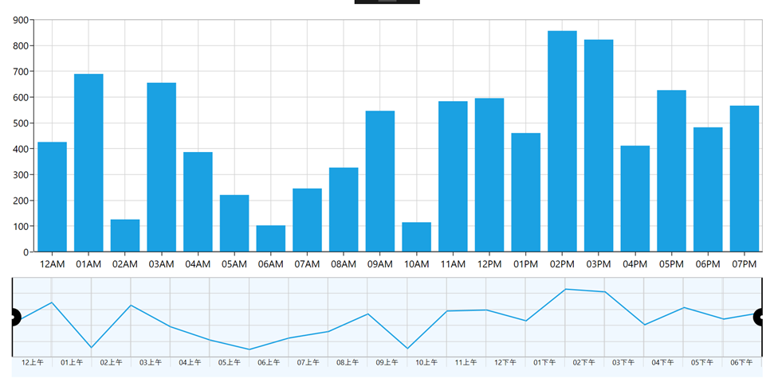

# How-to-customize-the-axis-label-format-based-on-the-culture-in-WPF-range-navigator
This article explains how to customize the axis label format based on culture in [Syncfusion WPF SfDateTimeRangeNavigator](https://help.syncfusion.com/wpf/range-selector/getting-started) as shown in the following image.

 

This can be achieved by using the LowerBarLabelsCreated event in SfDateTimeRangeNavigator for formatting the axis labels. SfDateTimeRangeNavigator allows you to the change axis label format, based on any culture like Chinese, French etc.

The following code illustrates how to format the axis label with Chinese language using the LowerBarLabelsCreated event.

[XAML]
```
<chart:SfDateTimeRangeNavigator x:Name="RangeNavigator" 
                                            ScrollbarVisibility="Hidden" 
                                            Background="AliceBlue" 
                                            HigherBarVisibility="Collapsed" 
                                            Margin="0,0,0,10"
                                            RangePadding="None"  
                                            ItemsSource="{Binding StockPriceDetails}" 
                                            LowerBarLabelsCreated="RangeNavigator_LowerBarLabelsCreated" 
                                            XBindingPath="XValue" >
                
                <chart:SfDateTimeRangeNavigator.Intervals>
                    <chart:Interval IntervalType="Hour" />
                    <chart:Interval IntervalType="Hour" />
                </chart:SfDateTimeRangeNavigator.Intervals>

                <chart:SfDateTimeRangeNavigator.LowerLevelBarStyle>
                    <chart:LabelBarStyle SelectedLabelBrush="Black" Position="Outside" />
                </chart:SfDateTimeRangeNavigator.LowerLevelBarStyle>

                <chart:SfDateTimeRangeNavigator.Content>
                    <chart:SfChart >
                        <chart:SfChart.PrimaryAxis>
                            <chart:DateTimeAxis Visibility="Collapsed"  />
                        </chart:SfChart.PrimaryAxis>

                        <chart:SfChart.SecondaryAxis>
                            <chart:NumericalAxis Visibility="Collapsed"/>
                        </chart:SfChart.SecondaryAxis>
                        <chart:LineSeries ItemsSource="{Binding StockPriceDetails}" XBindingPath="XValue"  YBindingPath="YValue"/>
                    </chart:SfChart>
                </chart:SfDateTimeRangeNavigator.Content>
            </chart:SfDateTimeRangeNavigator>
            
```
Argument from LowerBarLabelsCreated event LowerBarLabels has list of rendered label from range navigator. By changing the content of corresponding RangeNavigatorLabel with desired format, it has been achieved.

[C#]
```
private void RangeNavigator_LowerBarLabelsCreated(object sender, Syncfusion.UI.Xaml.Charts.LowerBarLabelsCreatedEventArgs e)
        {
            var lowerBarLabels = e.LowerBarLabels;
            foreach (var item in lowerBarLabels)
            {
                var actualContent = DateTime.Parse(item.Content.ToString());
                (item as RangeNavigatorLabel).Content = actualContent.ToString("hhtt", new CultureInfo("zh-hk"));
            }
        }
```

## See Also

[How to create SfDateTimeRangeNavigator in WPF](https://help.syncfusion.com/wpf/range-selector/getting-startedhttps://help.syncfusion.com/wpf/range-selector/label-customization)

[How to customize the label in SfDateTimeRangeNavigator](https://help.syncfusion.com/wpf/range-selector/label-customization)

[How to customize the tooltip settings](https://help.syncfusion.com/wpf/range-selector/tooltip-support)

